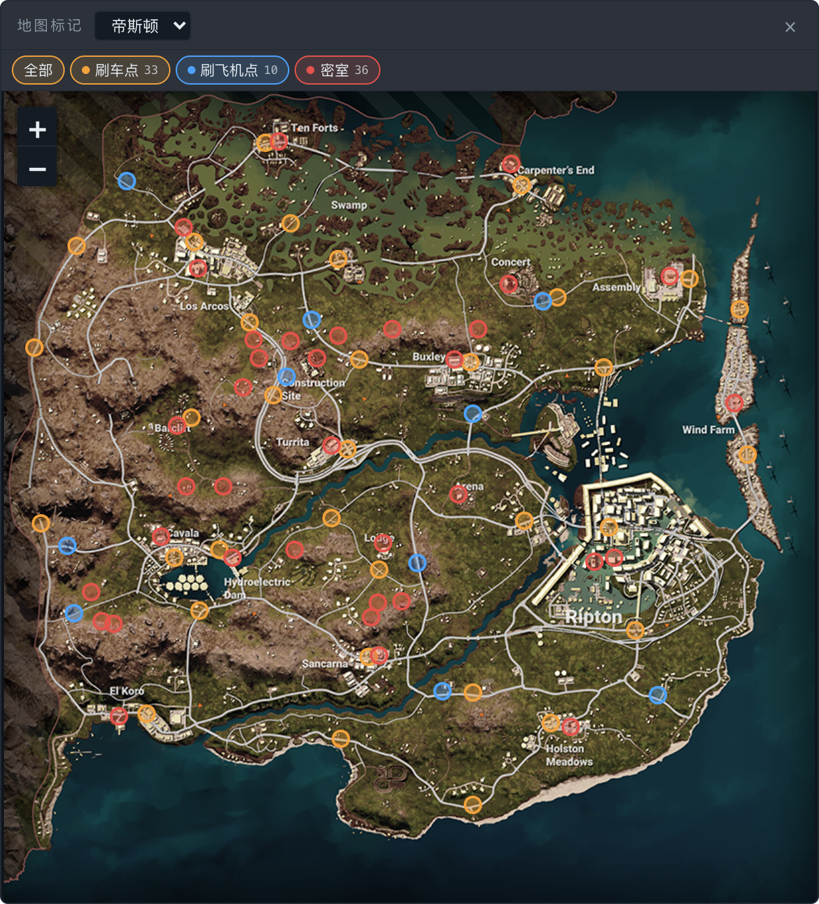
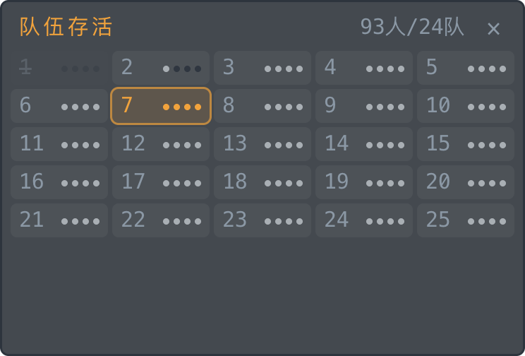
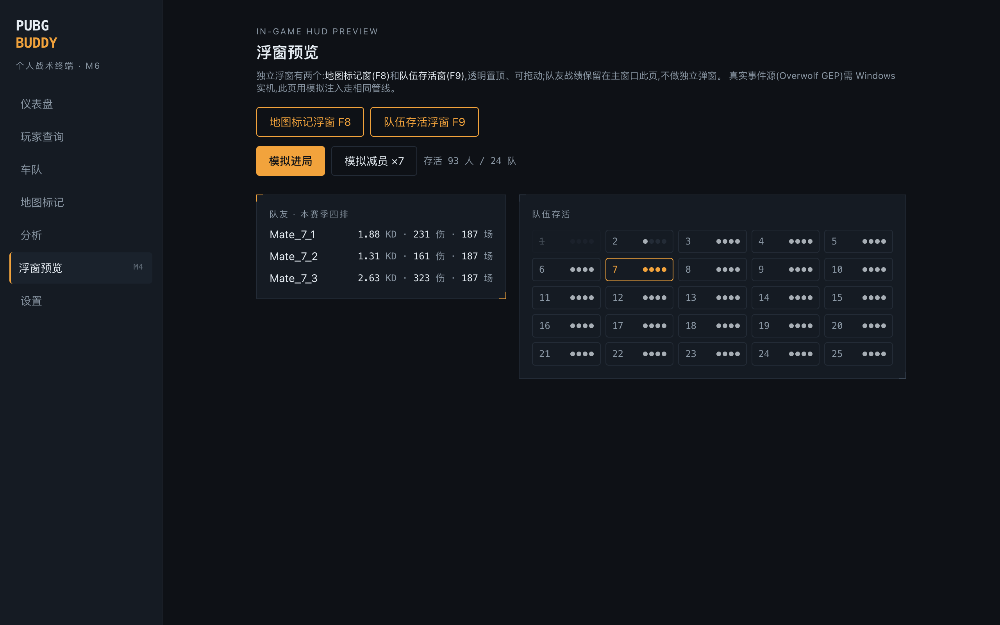
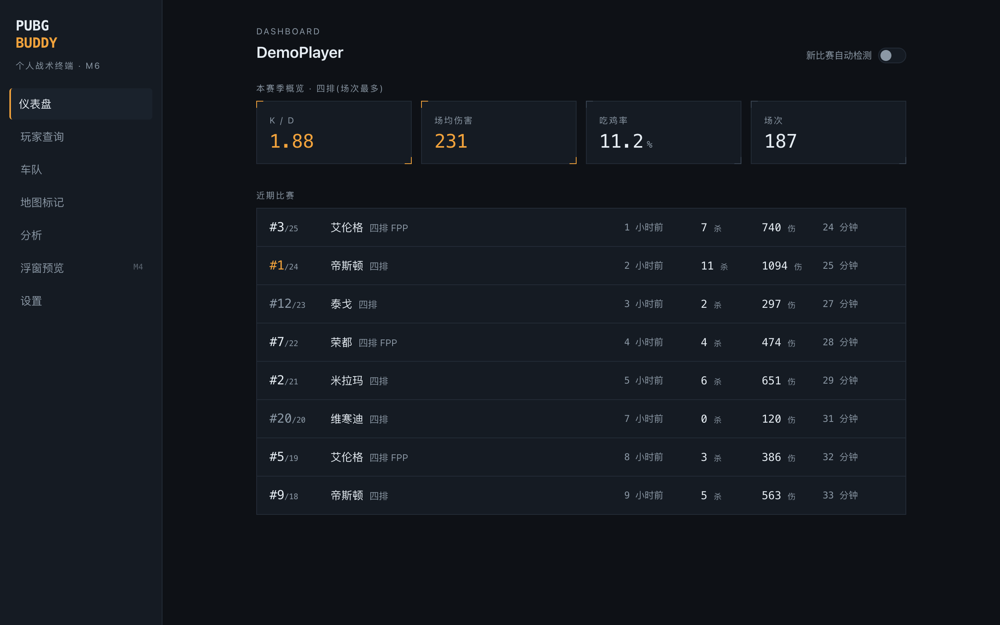
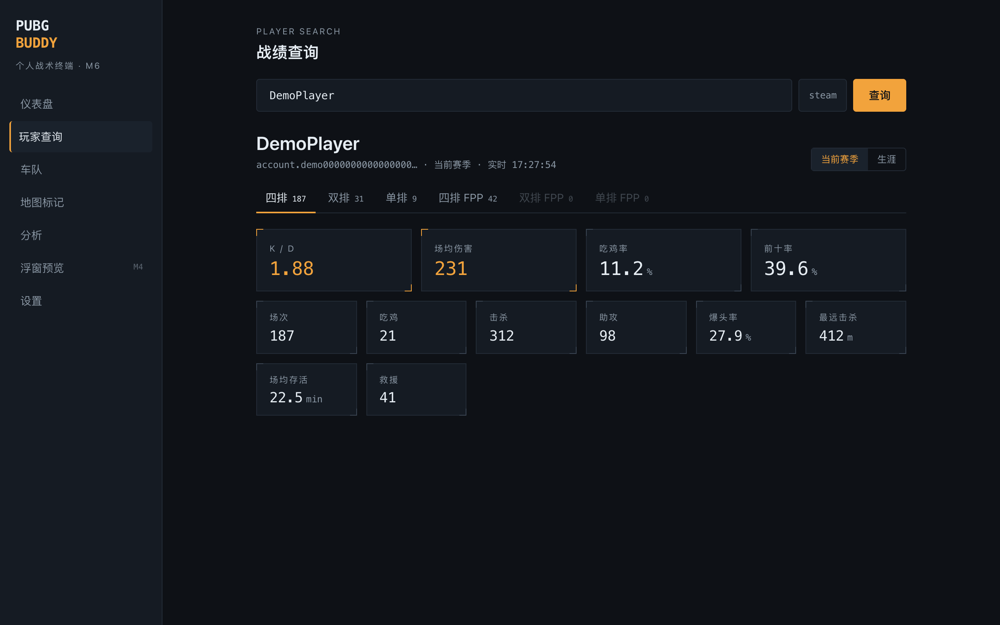
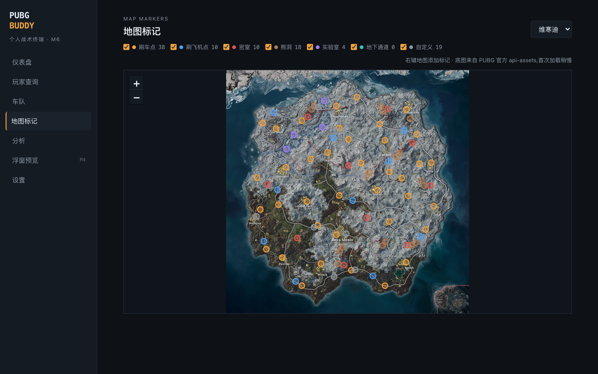
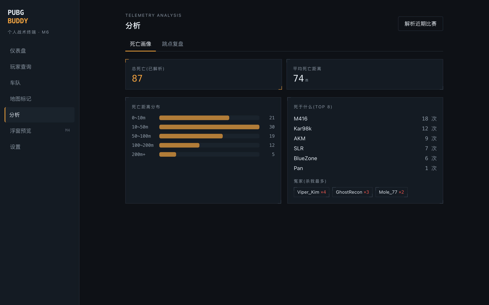

<div align="center">

# 🐔 PUBG Buddy

**个人自用的 PUBG 桌面战术助手 · A personal PUBG desktop tactical companion**

查战绩 · 赛后自动报告 · 游戏内透明浮窗(地图标记 / 队伍存活)· Telemetry 深度分析


**[中文](#-简介) · [English](#-overview)**



*游戏内地图标记浮窗:8K 官方底图 + 487 个内置点位(刷车点 / 刷飞机点 / 密室 / 熊洞 / 实验室 / 地下通道)*

</div>

---

## 📖 简介

PUBG Buddy 是一个基于 **PUBG 官方 API** 的本地桌面助手,单体 Electron 应用,数据全部存在本机 SQLite,无账号、无云端、无任何隐藏服务。

它解决三个日常痛点:

1. **懒得切网页查战绩** —— 桌面 App 内查任意玩家 / 自己 / 车队,打完一局自动弹出全员战报
2. **记不住刷车点和密室** —— 游戏内按 `F8` 呼出透明地图浮窗,内置 8 张图 487 个点位,还能右键加自己的标
3. **想知道自己为什么上不了分** —— Telemetry 深度分析:死亡画像、跳点复盘、"谁杀了我"

## ✨ 界面预览

| 游戏内队伍存活浮窗(F9) | 浮窗数据管线预览(模拟进局) |
|:---:|:---:|
|  |  |

| 仪表盘:赛季概览 + 近期比赛 | 玩家查询:六模式战绩 |
|:---:|:---:|
|  |  |

| 地图标记编辑器(维寒迪,7 类图层) | Telemetry 分析:死亡画像 |
|:---:|:---:|
|  |  |

## 🎯 功能特性

- **玩家查询**:精确昵称查任意玩家,赛季 / 生涯,solo / duo / squad × FPP / TPP 六模式
- **仪表盘**:本赛季概览卡片 + 近期比赛列表,点击进入全员比赛详情(我的队伍高亮)
- **赛后自动报告**:后台每 60s 轮询,打完一局 ≤3 分钟系统通知,点击直达本局全员数据
- **车队面板**:配置最多 10 人固定车队,一次批量请求并排对比,最优值高亮
- **游戏内浮窗**(透明、置顶、可拖动,游戏需无边框窗口化):
  - `F8` **地图标记窗** —— 8K 官方底图,分类图层开关,右键当场加标
  - `F9` **队伍存活窗** —— 25 队点阵实时显示各队剩余人数,我队高亮、全灭划线
- **内置 487 个标记点位**:由图像识别管线从社区攻略图自动提取(SIFT 特征配准到官方底图,像素级精度),分刷车点 / 刷飞机点 / 密室 / 熊洞 / 实验室 / 地下通道六类
- **Telemetry 分析**(免限流):死亡画像(死于什么武器 / 距离分布 / 冤家排行)、跳点复盘(落点 × 名次上图)
- **8K 底图秒开**:启动自动预缓存全部 10 张官方 8K 底图并转码为快速解码格式,之后全程本地秒开

## 🏗 技术架构

```
┌─────────── Electron 单体应用(无独立后端)───────────┐
│  主进程 = 后端                                        │
│    PUBG API Client(优先级限流队列 / 429 退避)        │
│    SQLite(比赛永久入库 / 多级缓存 / 标记 / 遥测聚合)  │
│    新比赛轮询器 → 系统通知                             │
│    Telemetry 管道(下载 / 解析 / 聚合)                │
│    8K 底图预取 + mapimg:// 流式协议                    │
│    TeamTracker 队伍存活状态机(GEP 接入缝已留好)       │
│  渲染进程 = 前端(React 19 + Tailwind 4 + Leaflet)    │
│    主窗口 7 页 + 两个独立透明浮窗                      │
└──────────────────────────────────────────────────────┘
```

| 层 | 选型 |
|---|---|
| 桌面框架 | Electron(electron-vite 构建,规划接入 ow-electron / Overwolf GEP) |
| 前端 | React 19 · TypeScript · Tailwind CSS 4 · TanStack Query · Leaflet |
| 数据 | better-sqlite3 单文件,手写 SQL |
| 点位提取 | Python + OpenCV(SIFT 配准 + HSV 图钉识别,见 `tools/marker-extract/`) |

## 🚀 快速开始

**零环境?Windows 直接双击 [`一键启动.bat`](一键启动.bat)** —— 自动检测并安装 Node.js(winget)→ 自动装依赖 → 启动应用,全程无需命令行。

已有 Node 环境的话,命令行方式:

```bash
git clone https://github.com/SUONSUN9527/pubg-buddy.git && cd pubg-buddy
npm install          # 自动 rebuild better-sqlite3
npm run dev          # 启动(dev 端口固定 5199)
```

1. 到 [developer.pubg.com](https://developer.pubg.com) **免费**申请 API Key(默认限流 10 次/分钟,本项目的缓存设计足够用)
2. 打开 App → 设置页 → 填入 Key 并验证、绑定自己的游戏昵称
3. 完成。查询、仪表盘、赛后通知、浮窗全部可用

> 💰 **完全免费**:PUBG 官方 API 免费、地图素材来自官方公开仓库、无任何付费第三方服务,零运行成本。

> 主要功能面向 **Windows 10/11**;纯桌面部分(查询 / 分析 / 标记编辑)在 macOS 上也能开发运行。
> 单测:`npm test` · 类型检查:`npm run typecheck`
> 产品需求与技术方案:[docs/PRD.md](docs/PRD.md) · [docs/TECH.md](docs/TECH.md)

## 🗺 自定义标记点位

内置点位由 `tools/marker-extract/` 的三步管线生成:攻略图放入 `community-maps/`(第三方版权内容,不随仓库分发)→ SIFT 自动配准到官方底图 → HSV 色块识别图钉 → 生成种子。想换攻略图源照着 README 跑一遍即可。

## 🛣 路线图

- [ ] Overwolf GEP 接入(Windows 实机):进局自动获取队友 / 全场存活数据,浮窗零操作
- [ ] 屏幕识别 V2:打开游戏 M 地图时,标记自动对齐叠加到游戏地图上
- [ ] MCP Server:接入 Claude 等 LLM,自然语言问"我最近 20 场为什么掉分"
- [ ] 车队周报机器人

## ⚖️ 声明

- 本项目为**个人自用工具**,与 KRAFTON / PUBG Corp. 无任何关联,非官方项目
- 数据来自 [PUBG 官方开发者 API](https://developer.pubg.com);地图图片来自官方 [api-assets](https://github.com/pubg/api-assets) 仓库,版权归 KRAFTON 所有
- **不注入游戏进程、不读内存、不抓包**,仅使用官方公开数据与屏幕上本就可见的信息,请遵守 PUBG 服务条款
- License:[MIT](LICENSE)

---

## 📖 Overview

**PUBG Buddy** is a local desktop companion for PUBG built on the **official PUBG API** — a single Electron app with all data stored in local SQLite. No accounts, no cloud, no hidden services.

It solves three everyday annoyances:

1. **Tired of alt-tabbing to stats websites** — query any player / yourself / your squad in-app, and get an automatic full-lobby report minutes after every match
2. **Can't remember vehicle spawns & secret rooms** — press `F8` in game for a transparent map overlay with 487 built-in markers across 8 maps, right-click to add your own
3. **Wondering why you can't rank up** — deep telemetry analytics: death profile, drop-spot review, "who killed me"

## ✨ Screenshots

See the gallery above — in-game map overlay (hero image), team-alive tracker overlay (`F9`), dashboard, player search, marker editor and telemetry analysis.

## 🎯 Features

- **Player search**: exact-name lookup, season / lifetime, all six modes (solo/duo/squad × FPP/TPP)
- **Dashboard**: season overview + recent matches, click through to full-lobby match detail with your team highlighted
- **Auto post-match report**: background polling every 60s; system notification ≤3 min after each match ends
- **Squad panel**: up to 10 fixed teammates, compared side-by-side in a single batched API request
- **In-game overlays** (transparent, always-on-top, draggable; game in borderless windowed mode):
  - `F8` **Map markers** — official 8K map, per-type layer toggles, right-click to add markers
  - `F9` **Team tracker** — compact 25-team grid showing alive counts per squad
- **487 built-in markers** auto-extracted from community guide images via a CV pipeline (SIFT registration onto official maps + HSV pin detection): vehicle spawns, motor gliders, secret rooms, bear caves, labs, underground tunnels
- **Telemetry analytics** (rate-limit-free): death profile (weapons / distance buckets / nemesis list) and drop-spot review (landings × placement on the map)
- **Instant 8K maps**: all 10 official 8K maps are prefetched on startup and transcoded for fast decode — everything loads locally afterwards

## 🏗 Architecture

Single Electron app, no separate backend. The main process **is** the backend: PUBG API client with a priority rate-limit queue, SQLite storage (matches are immutable and cached forever), a match poller wired to system notifications, the telemetry pipeline, an 8K map prefetcher behind a custom `mapimg://` streaming protocol, and a pure `TeamTracker` state machine with a clean seam for the planned Overwolf GEP integration. The renderer is React 19 + Tailwind 4 + Leaflet, serving the 7-page main window plus two standalone transparent overlay windows.

## 🚀 Quick start

**No dev environment? On Windows just double-click [`一键启动.bat`](一键启动.bat)** — it auto-installs Node.js via winget, installs dependencies and launches the app. No terminal needed.

Or the classic way if you already have Node:

```bash
git clone https://github.com/SUONSUN9527/pubg-buddy.git && cd pubg-buddy
npm install
npm run dev
```

1. Grab a **free** API key at [developer.pubg.com](https://developer.pubg.com) (the default 10 RPM limit is plenty thanks to aggressive caching)
2. Open Settings → paste the key, verify, and bind your in-game name
3. Done — search, dashboard, post-match notifications and overlays are all live

> 💰 **Completely free to run**: the official PUBG API is free, map assets come from the official public repo, and there are no paid third-party services.

> Primary target is **Windows 10/11**; the pure-desktop parts also run on macOS for development. Tests: `npm test` · Typecheck: `npm run typecheck`

## 🛣 Roadmap

- [ ] Overwolf GEP integration (real in-game roster → zero-touch overlays)
- [ ] Screen-recognition V2: auto-align markers on top of the in-game map (M)
- [ ] MCP server for LLM-powered stats Q&A
- [ ] Weekly squad report bot

## ⚖️ Disclaimer

- Personal-use tool, **not affiliated with KRAFTON / PUBG Corp.** in any way
- Data comes from the [official PUBG developer API](https://developer.pubg.com); map imagery from the official [api-assets](https://github.com/pubg/api-assets) repo, © KRAFTON
- **No game-process injection, no memory reading, no packet sniffing** — only official public data and information already visible on your screen. Play by the PUBG Terms of Service
- Licensed under [MIT](LICENSE)
